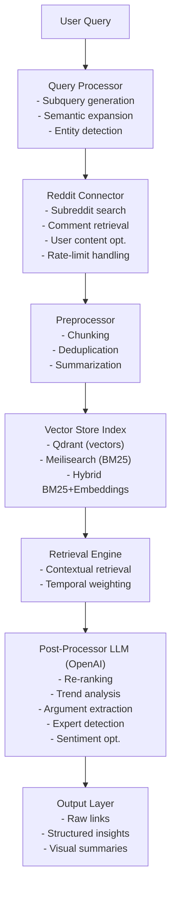

# High-Level Architecture Diagram

```mermaid
flowchart TD
    Q[User Query] --> QP[Query Processor<br/>- Subquery generation<br/>- Semantic expansion<br/>- Entity detection]
    QP --> RC[Reddit Connector<br/>- Subreddit search<br/>- Comment retrieval<br/>- User content opt.<br/>- Rate-limit handling]
    RC --> PP[Preprocessor<br/>- Chunking<br/>- Deduplication<br/>- Summarization]
    PP --> VS["Vector Store Index<br/>- Qdrant (vectors)<br/>- Meilisearch (BM25)<br/>- Hybrid BM25+Embeddings"]
    VS --> RE[Retrieval Engine<br/>- Contextual retrieval<br/>- Temporal weighting]
    RE --> LLM["Post-Processor LLM (OpenAI)<br/>- Re-ranking<br/>- Trend analysis<br/>- Argument extraction<br/>- Expert detection<br/>- Sentiment opt."]
    LLM --> OUT[Output Layer<br/>- Raw links<br/>- Structured insights<br/>- Visual summaries]
```