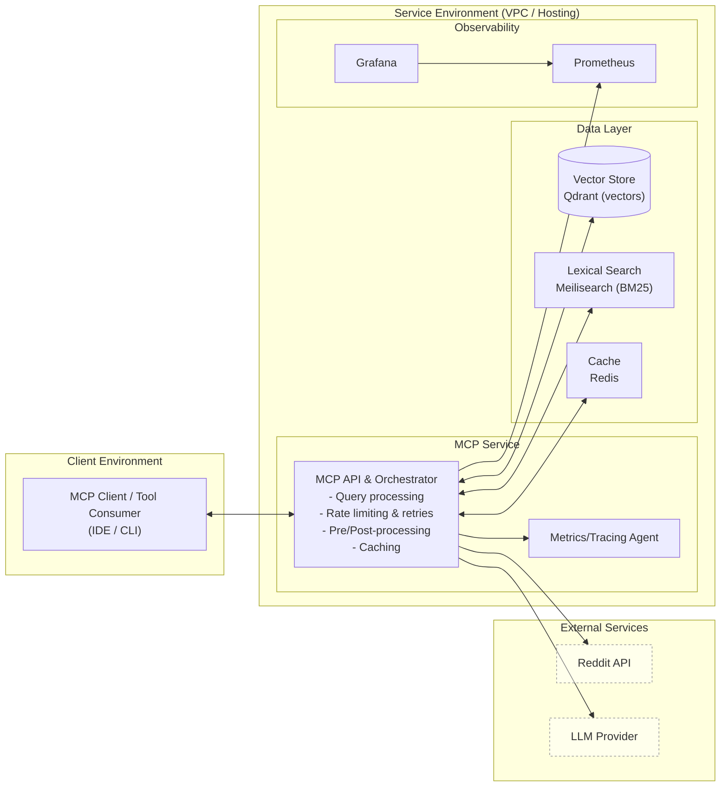

# Deployment Diagram

```mermaid
flowchart LR
    %% Client Side
    subgraph CLIENT["Client Environment"]
        CL["MCP Client / Tool Consumer<br/>(IDE / CLI)"]
    end

    %% Service (App) Layer inside a VPC or hosting env
    subgraph VPC["Service Environment (VPC / Hosting)"]
        subgraph APP["MCP Service"]
            SVC["MCP API & Orchestrator<br/>- Query processing<br/>- Rate limiting & retries<br/>- Pre/Post-processing<br/>- Caching"]
            METRICS["Metrics/Tracing Agent"]
        end

        subgraph DATA["Data Layer"]
            VS[("Vector Store<br/>Qdrant (vectors)")]
            LEX["Lexical Search<br/>Meilisearch (BM25)"]
            CACHE["Cache<br/>Redis"]
        end

        subgraph OBS["Observability"]
            PROM["Prometheus"]
            GRAF["Grafana"]
        end
    end

    %% External Dependencies
    subgraph EXT["External Services"]
        REDDIT["Reddit API"]
        LLM["LLM Provider"]
    end

    %% Connections
    CL <--> SVC
    SVC --> REDDIT
    SVC <--> VS
    SVC <--> LEX
    SVC <--> CACHE
    SVC --> LLM
    SVC --> METRICS
    SVC --> PROM
    GRAF --> PROM

    %% Notes
    classDef ext fill:#fff6,stroke:#999,stroke-dasharray: 3 3;
    class REDDIT,LLM ext;
```

